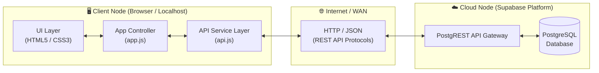

# 📝 Cloud-Powered Distributed To-Do List

A modern, responsive To-Do List web application built with **Vanilla JavaScript, HTML5, and CSS3**, seamlessly connected to **Supabase Cloud** via **REST API**. 

This project was developed as a practical implementation for a **Distributed Systems** course, illustrating how client-side applications decouple presentation from state persistence across distributed network nodes.

---

## 🌟 Key Features

- **Full CRUD Operations**:
  - `GET`: Fetch all tasks or individual items asynchronously.
  - `POST`: Create and persist new tasks with title, description, and priority.
  - `PATCH`: Toggle task completion state and edit details inline via modal.
  - `DELETE`: Remove tasks with smooth exit animations.
- **Distributed System Telemetry (API Activity Log)**:
  - Real-time logger showing HTTP method, endpoint, status, and network round-trip latency (`ms`).
- **Priority Management**: Color-coded badges for `High` 🔴, `Medium` 🟡, and `Low` 🟢 priorities.
- **Dynamic Filtering & Metrics**: Instant filtering (`All`, `Active`, `Completed`) with dynamic progress stats counters.
- **Interactive UI/UX**:
  - Glassmorphic, modern dark-mode aesthetics with micro-animations.
  - Toast notifications for feedback on all network requests.
  - Modal editor with keyboard shortcut support (<kbd>Esc</kbd> to close).
- **Pure Web Stack**: No external bulky framework dependencies — lightweight, fast, and easily deployable.

---

## 🏛️ System Architecture

The application adopts a **Client-Server Distributed Architecture**:



### Why It Represents a Distributed System
1. **Independent Nodes**: The presentation layer (Client browser) and data storage layer (Supabase Cloud server) operate on distinct, decoupled physical machines.
2. **Network Inter-Process Communication (IPC)**: Data exchange takes place over the public internet utilizing HTTP REST standards.
3. **Stateless Protocol**: Every HTTP request is standalone and authenticated via request headers (`apikey` and `Bearer token`), fulfilling the architectural requirements of REST.

---

## 📂 Project Structure

```text
.
├── index.html        # Semantic HTML5 layout and modal structures
├── style.css         # Modern styling, responsive layout & animations
├── config.js         # Cloud endpoint configuration and API keys
├── api.js            # REST API Service abstraction (fetch wrapper for CRUD)
├── app.js            # Main application controller, UI renderers & event handlers
├── belajar_api.md    # Documentation and educational reference for HTTP methods
└── README.md         # Project documentation
```

---

## 🚀 Getting Started

### 1. Clone the Repository
```bash
git clone https://github.com/Erden276/To-Do-List.git
cd To-Do-List
```

### 2. Configuration
The application connects to a Supabase project. If you wish to use your own Supabase instance, update `config.js`:

```javascript
const SUPABASE_URL = 'https://YOUR_PROJECT_ID.supabase.co';
const SUPABASE_KEY = 'YOUR_SUPABASE_ANON_KEY';
const API_BASE = `${SUPABASE_URL}/rest/v1`;
```

Ensure your Supabase PostgreSQL table named `todos` has the following schema:
- `id` (bigint / int8, Primary Key, generated by default as identity)
- `title` (text, not null)
- `description` (text, nullable)
- `priority` (text, default `'medium'`)
- `is_completed` (boolean, default `false`)
- `created_at` (timestamp with time zone, default `now()`)

### 3. Run Locally
Because this project uses vanilla frontend technologies, you can run it simply by opening `index.html` in any web browser, or via a local server:

- **VS Code Live Server**: Right-click `index.html` and click **"Open with Live Server"**.
- **Python HTTP Server**:
  ```bash
  python -m http.server 3000
  ```
- **Node.js `serve`**:
  ```bash
  npx serve .
  ```

---

## 📡 REST API Reference

| Operation | HTTP Method | Endpoint | Description |
| :--- | :---: | :--- | :--- |
| **Fetch All** | `GET` | `/todos?select=*&order=created_at.desc` | Retrieves all tasks sorted chronologically |
| **Fetch by ID** | `GET` | `/todos?id=eq.{id}&select=*` | Retrieves a single task by its unique ID |
| **Create** | `POST` | `/todos` | Inserts a new task item into PostgreSQL |
| **Update** | `PATCH` | `/todos?id=eq.{id}` | Modifies task fields or toggles completion status |
| **Delete** | `DELETE` | `/todos?id=eq.{id}` | Removes a task item permanently from the database |

---

## 👤 Author
- **GitHub**: [@Erden276](https://github.com/Erden276)
- **Course**: Distributed Systems / Cloud Computing

---

## 📄 License
This project is open-source and available under the [MIT License](LICENSE).
